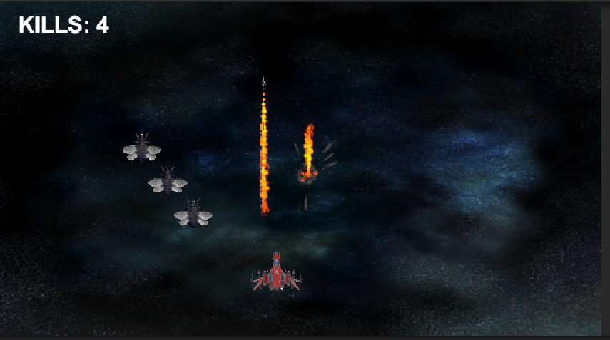
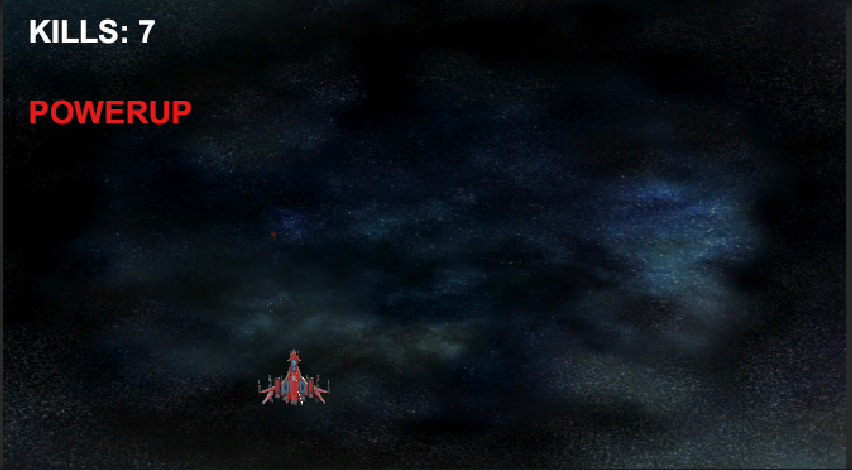
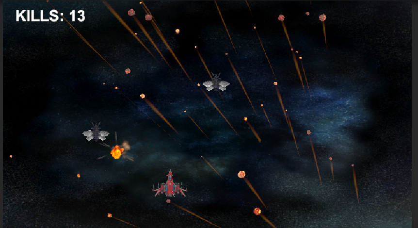

# TopDownSpaceShooter
A C# Game Developed using Unity 3D and Free Assets from the Unity Asset Store. Implements wave and enemy patterns as well as shooting movement and powerups.

## A Basic Start Game

</img>

## Powerups Against Enemies Can Be Achieved

</img>

## Meteorites Can Be Launched By Pressing 'm' and firing!

</img>

## What it has.

By using the wonderful assets from the Unity Asset Store, I was able to create a real looking game. I firt assigned my ship a turning behavior with the ability to shoot missiles and emulate a star shooting game. My enemies have a consistant wave, and have utilize a custom path. I assigned particle effects and dissipation of them and I encorporated an infinite game with many possibilites to get powerups and shoot down enemies.

## What I learned from this Project

I learned quite a few things from this project. I learned how properly setup up a game and apply knowledge of previously learned technologies in Unity (ie: Canvas) for score counting. I applied my knowledge of Physics in the Game Engine to successfully be able to create shooting and projectile game. Overrall I am very excited to what more I can expand using the Unity Game Engine.

## License
This code is Licensed under the Apache 2.0 License. This only applies to the code written by me and not by the developers of any Asset pack.
The code under this license is under the Assets folder specifically: EE.cs, Despawn2.cs, and FlameScript.cs. The other code is in Assets/Scenes/Scripts which the EnemyBehavior.cs, MissileBehavior.cs, ShipBehavior.cs, and Despawn.cs code reside.
